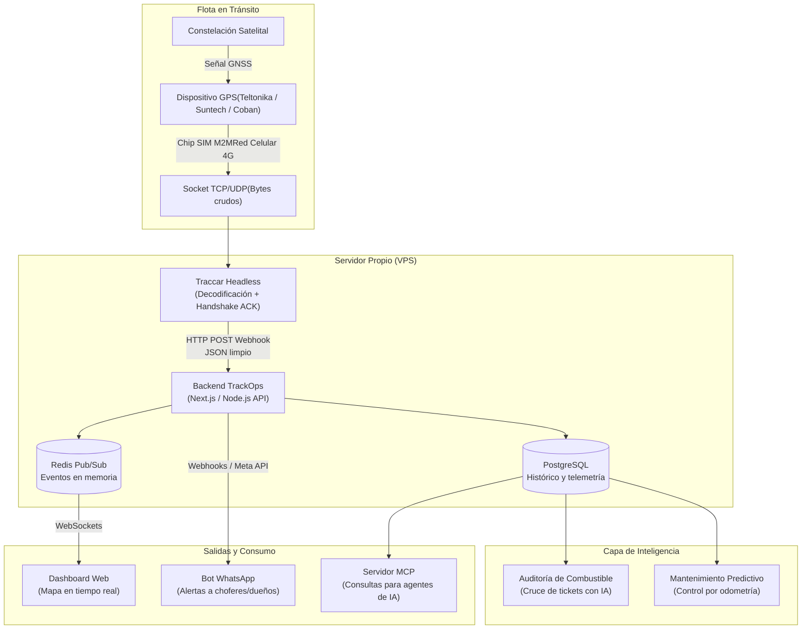

# Fundamentos de Conectividad, Hardware y Arquitectura de Telemetría

Este documento resume por qué la combinación de un **dispositivo GPS dedicado**, una **tarjeta SIM M2M** e **infraestructura de ingestión propia** constituye el estándar técnico indispensable para la operación de TrackOps, y por qué se descarta la intermediación con plataformas terceras como Urbetrack.

---

### 1. El rol del GPS y la necesidad del chip

- **El GPS es solo un receptor:** La antena del equipo se limita a recibir señales de la constelación de satélites para triangular latitud, longitud, altitud y velocidad. El hardware no tiene capacidad propia para transmitir esos datos a internet.
- **El canal de transmisión (El Chip):** Para que las coordenadas lleguen a la plataforma en tiempo real, el dispositivo requiere un módem celular que empaqueta la telemetría y la envía a través de la red móvil (GPRS/4G/LTE-M) hacia los servidores centrales.

---

### 2. Chips Prepago vs. Chips Corporativos M2M/IoT

| Característica            | Chip Celular Común (Prepago)                                               | Chip Corporativo M2M / IoT                                                                 |
| ------------------------- | -------------------------------------------------------------------------- | ------------------------------------------------------------------------------------------ |
| **Continuidad operativa** | Se corta el servicio si se agota el saldo o vence la recarga.              | Facturación mensual fija; nunca se suspende por saldo en ruta.                             |
| **Estabilidad de red**    | Las operadoras bloquean líneas residenciales con sockets TCP persistentes. | Diseñado específicamente para transmisiones de telemetría continuas 24/7.                  |
| **Cobertura en ruta**     | Atado a una sola antena (ej. solo Claro o solo Movistar).                  | **Multi-operador con Roaming Nacional:** conmuta automáticamente a la red con mejor señal. |
| **Gestión de flota**      | Requiere recargas manuales número por número.                              | Panel centralizado para activar, pausar y monitorear el consumo de toda la flota.          |
| **Consumo de datos**      | Planes sobredimensionados de Gigabytes.                                    | Paquetes eficientes de 15 a 30 MB por mes (suficiente para reportes cada 30 segundos).     |

---

### 3. Por qué no conviene tercerizar la telemetría con Urbetrack

Tercerizar la capa de rastreo con un intermediario tradicional introduce fricciones comerciales y limitaciones técnicas que impactan directamente en el servicio:

- **Erosión del margen operativo (Doble intermediación):** Urbetrack comercializa un abono mensual recurrente por vehículo que incluye la licencia de su propia interfaz web. Pagar por un software que no se va a utilizar traslada un sobrecosto evitable al cliente final. Con infraestructura propia, los costos fijos por unidad se limitan a la SIM M2M (~$1 a$2,5 USD) y el cómputo en el VPS.
- **Cuellos de botella por Rate Limits y Polling:** Gran parte de los proveedores tradicionales operan mediante APIs REST pensadas para reportes periódicos. Límites estrictos de peticiones por minuto (`HTTP 429`) impiden actualizar mapas en tiempo real con alta frecuencia o procesar flotas grandes sin encolamiento.
- **Latencia y falta de Webhooks nativos:** Si el proveedor no despacha webhooks en tiempo real ante eventos críticos, la plataforma debe consultar constantemente sus servidores (*polling*), generando demoras en la emisión de alertas inmediatas por WhatsApp.
- **Dependencia operativa (*Vendor Lock-in*):** Acoplar la arquitectura a la API de un tercero deja el servicio expuesto a caídas ajenas, aumentos imprevistos de tarifas o discontinuidad de endpoints sin previo aviso.
- **Pérdida de granularidad en la telemetría:** Las APIs comerciales suelen filtrar la información para devolver resúmenes básicos (latitud y longitud), descartando datos crudos de acelerómetros, estados de entradas digitales o telemetría detallada de motor (CAN bus), vitales para la auditoría de combustible con IA y el mantenimiento predictivo.
- **Compatibilidad de hardware para el cliente:** Administrar la ingestión de manera directa permite homologar cualquier equipo GPS que el cliente ya tenga instalado en sus unidades (Teltonika, Suntech, Queclink, Coban), eliminando el costo de recambio obligatorio de hardware.

---

### Conclusión Técnica

Para asegurar autonomía operativa, costos predecibles, modelos de IA precisos y alertas confiables en tiempo real, la solución se estructura sobre el control directo del flujo de datos:

$$
\text{Dispositivo GPS homologado} + \text{SIM M2M Multi-operador} + \text{Ingestión propia} = \text{Telemetría en tiempo real}
$$

---

Reportar con mayor frecuencia no aumenta los costos de forma lineal, porque el protocolo binario de telemetría es extremadamente liviano. La diferencia económica depende casi exclusivamente de dos variables: el **paquete de datos de la SIM M2M** y el **consumo de servidor (cómputo y base de datos)**.

---

### 1. Consumo de datos por vehículo (Cálculo real)

Un equipo GPS estándar (por ejemplo, Teltonika con protocolo Codec 8) envía un paquete de aproximadamente **100 a 150 bytes** por reporte vía socket TCP.

Suponiendo un vehículo operando **10 horas al día, 26 días al mes**:

| Frecuencia                       | Reportes/hora | Total reportes/mes | Volumen de datos aprox. | Plan SIM M2M requerido        |
| -------------------------------- | ------------- | ------------------ | ----------------------- | ----------------------------- |
| **Cada 60 seg**                  | 60            | ~15.600            | **~3 a 5 MB**           | Plan base (10 MB)             |
| **Cada 30 seg** (Estándar)       | 120           | ~31.200            | **~6 a 10 MB**          | Plan base (10 MB - 20 MB)     |
| **Cada 10 seg** (Flota urbana)   | 360           | ~93.600            | **~18 a 28 MB**         | Plan estándar (30 MB - 50 MB) |
| **Cada 5 seg** (Ultra precisión) | 720           | ~187.200           | **~35 a 55 MB**         | Plan medio (50 MB - 100 MB)   |

*Nota: Cuando el vehículo está con el motor apagado, el GPS entra en modo reposo (sleep) y solo envía 1 ping cada 5 a 15 minutos, por lo que el consumo en reposo es prácticamente nulo.*

---

### 2. Impacto en los costos

- **Costo de la SIM M2M:**
- Subir de 10 MB a 50 MB mensuales prácticamente no mueve la aguja: suele costar entre **+**$0,30 y +$**1,00 USD extra al mes por vehículo**. La mayoría de los proveedores M2M cobran entre $1,50 y$**3,00 USD** por líneas de hasta 50 MB con roaming multi-operador.

  
- **Costo de Servidor (VPS y Base de Datos):**
- Reportar cada 5 segundos contra 100 camiones significa recibir 20 escrituras por segundo en la base de datos.
- Un VPS estándar (2 vCPU, 4 GB RAM en Hetzner o DigitalOcean por $7 a$**12 USD/mes**) puede procesar holgadamente miles de reportes por minuto usando Traccar y PostgreSQL.
- Si la frecuencia es de 5 o 10 segundos, la base de datos acumula registros mucho más rápido. Para no inflar los costos de almacenamiento en disco, se implementa una política de **retención y compresión** (por ejemplo, guardar el segundo a segundo durante 30 días y consolidar promedios para el historial antiguo).

---

### 3. La alternativa eficiente: Reporte inteligente por eventos

En lugar de forzar al GPS a enviar datos cada 5 segundos fijos en línea recta por la ruta (lo que satura la base de datos con coordenadas redundantes), los equipos se configuran con **lógica por ángulos y distancia**:

- **En línea recta:** Reporta cada 30 segundos.
- **Al girar en una esquina (cambio de rumbo &gt; 15°):** Dispara un reporte inmediato para que el trazado en el mapa quede perfecto.
- **Por variación de velocidad o frenada brusca:** Dispara un evento inmediato.

Con esta configuración se obtiene la misma precisión visual que reportar cada 5 segundos, pero manteniendo el consumo mensual dentro de los **15 a 20 MB por vehículo**.

